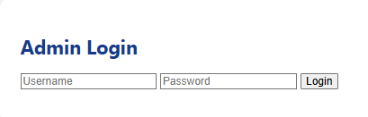
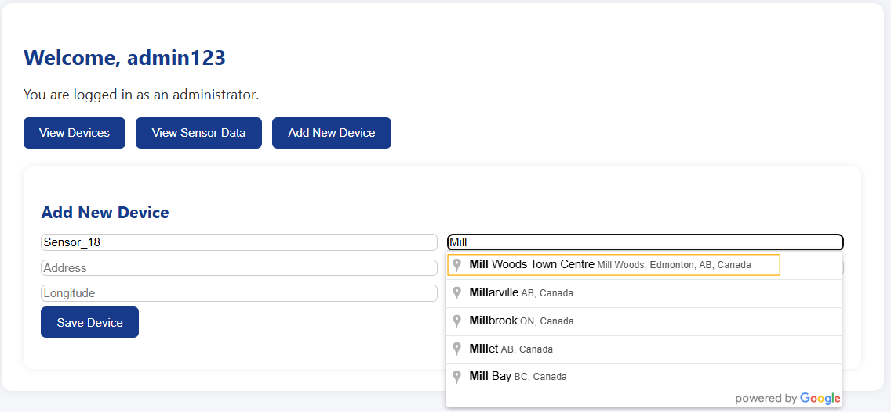
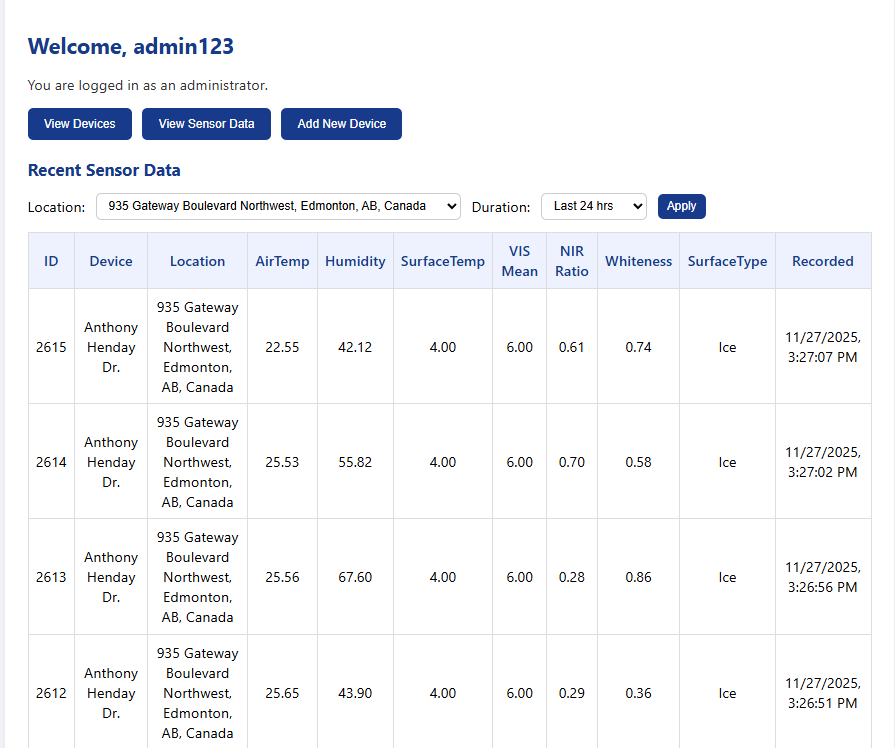
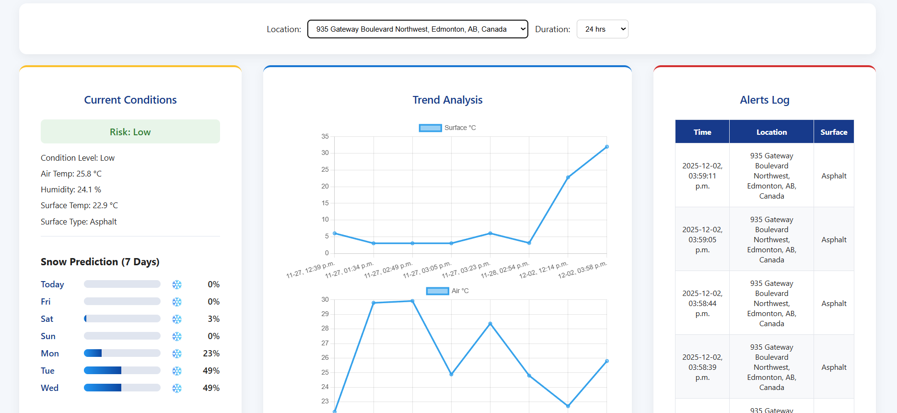
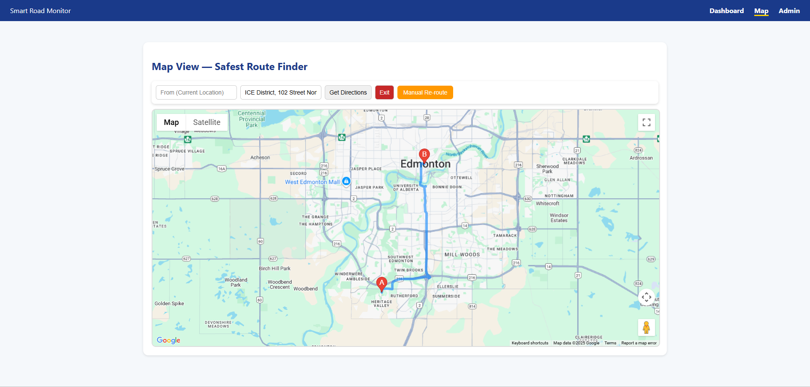
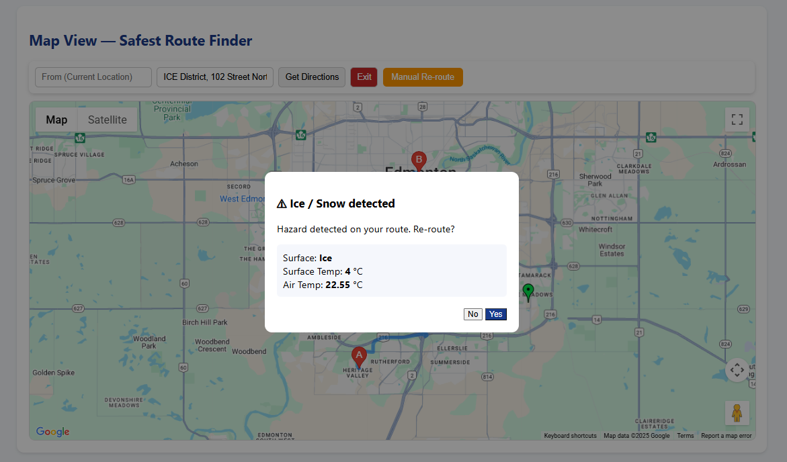
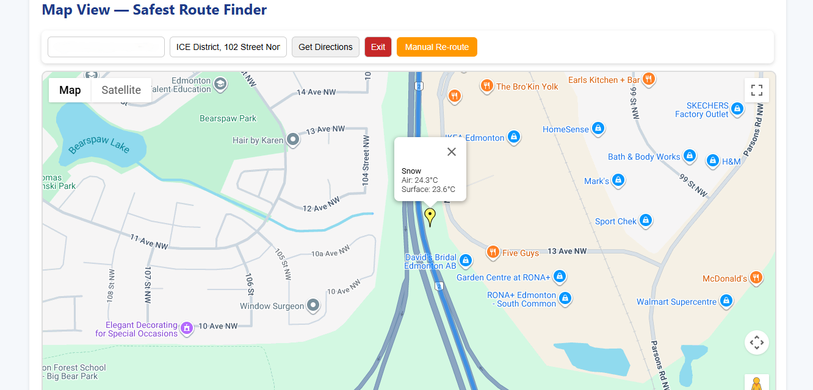
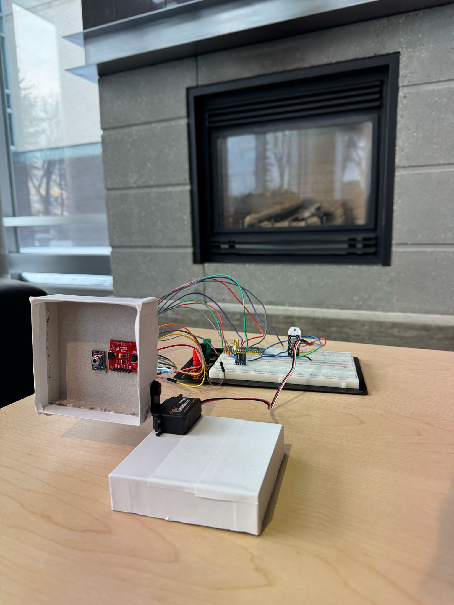

---

# 🔌 Hardware Layer

• Raspberry Pi Pico 2 W – Main controller  
• MLX90614 – Surface temperature sensor  
• DHT22 – Air temperature & humidity sensor  
• AS7343 – Spectral sensor (VIS Mean, NIR Ratio, Whiteness Index)  
• REYAX RYLR998 – LoRa communication module  

---

# 📡 Communication

• UART-based AT command LoRa transmission  
• Long-range, low-power communication  
• Reliable packet delivery to backend API  

---

# 🧠 Backend (ASP.NET Core)

• RESTful Web API  
• Entity Framework Core  
• SQL Server database  
• Device registration & management  
• Location-based filtering  
• Risk classification logic  
• Historical data retrieval  

---

# 📊 Dashboard Features

• Real-time sensor data display  
• Surface classification (Ice / Snow / Asphalt)  
• Risk indicator (Low / Medium / High)  
• Trend analysis graphs  
• Snow prediction integration  
• Historical data filtering  
• Alerts log system  

---

# 🗺 Map & Route Safety System

• Google Maps API integration  
• Hazard marker placement  
• Ice / Snow popup alerts  
• Route risk detection  
• Manual and automatic rerouting  

---

# 🖼 Project Screenshots

## 🔐 Admin Login

---

## ➕ Add New Device

---

## 📈 View Sensor Data

---

## 📊 Dashboard Overview

---

## 🗺 Safe Route Finder

---

## ⚠️ Ice / Snow Alert Popup

---

## ❄️ Snow Detection on Map

---

## 🔧 Hardware Setup

---

# 🎥 System Demonstrations

## ❄️ Snow Detection
<video src="assets/snow_detection.mp4" controls width="800"></video>

Demonstrates real-time snow surface classification using spectral analysis and temperature thresholds. Sensor data is transmitted via LoRa, persisted in SQL Server, and dynamically retrieved by the dashboard for visualization and risk evaluation.

---

## 🛣 Asphalt Detection
<video src="assets/asphalt_detection.mp4" controls width="800"></video>

Shows safe asphalt detection using VIS mean, NIR ratio, and surface temperature metrics. The backend processes the data and updates the dashboard to confirm safe road conditions.

---

## 🧊 Ice Detection
<video src="assets/ice_detection.mp4" controls width="800"></video>

Illustrates hazardous ice detection triggered by low surface temperature and spectral reflectivity characteristics. The detected condition is transmitted over LoRa, stored in the database, and immediately reflected in the dashboard with updated risk indicators and route hazard alerts.

---

# 🛠 Technologies Used

C#  
ASP.NET Core  
Entity Framework Core  
SQL Server  
Raspberry Pi Pico W  
MicroPython  
LoRa (REYAX RYLR998)  
Google Maps API  
WeatherAPI  
REST APIs  
Embedded Systems  

---

# 🚀 Key Highlights

✔ End-to-end IoT data pipeline  
✔ Embedded systems + full-stack integration  
✔ Real-time hazard detection  
✔ Database-driven dashboard  
✔ Geospatial route safety analysis  
✔ Admin management interface  
✔ Risk classification logic  

---

# 👥 Collaboration

Developed in collaboration with Agamdeep Singh Sandhu.

---

# 👨‍💻 Author

**Sandip Bohara Chhetri**  
Computer Engineering Technologist  
IoT | Embedded Systems | Full-Stack Development  
